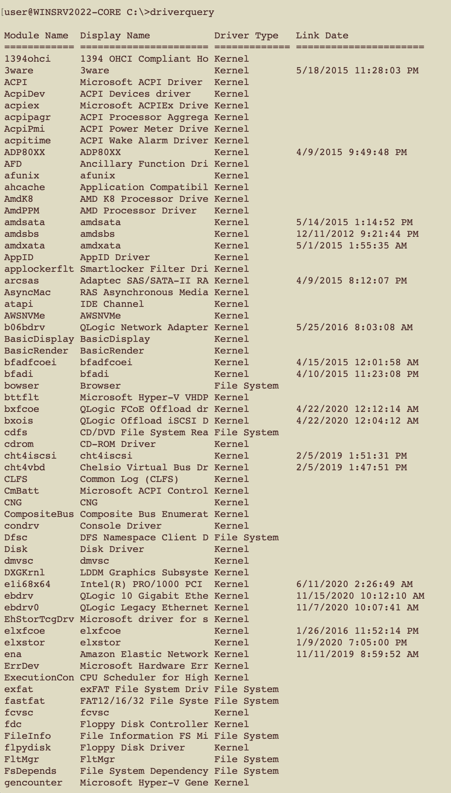
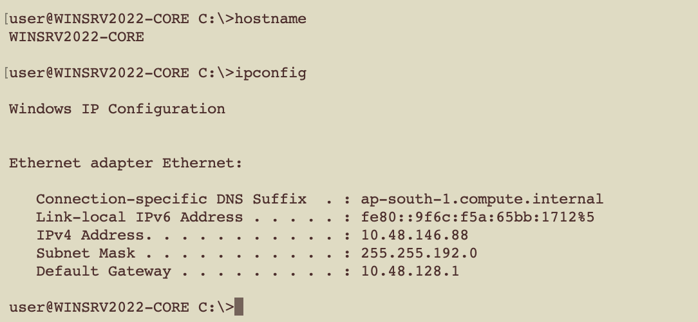
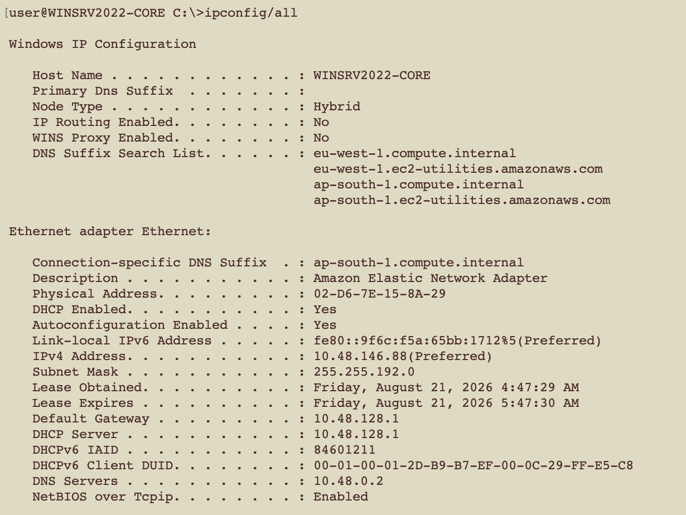
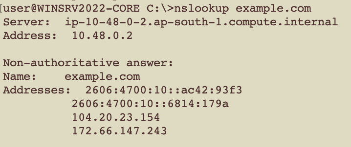
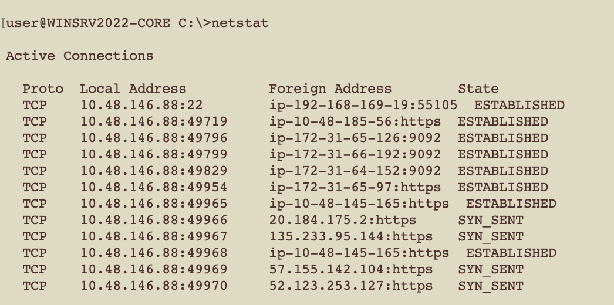
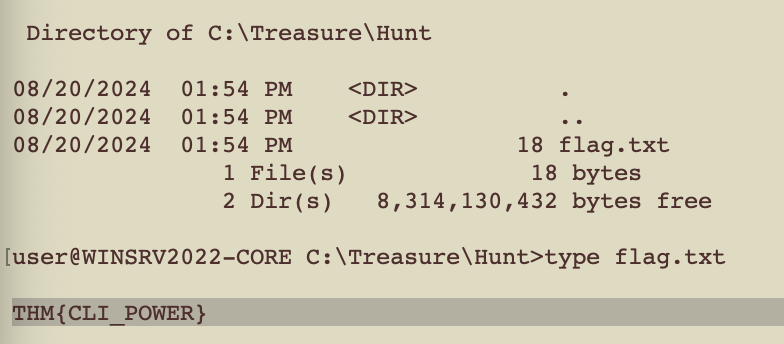

# Windows CMD Line — TryHackMe Lab Notes

> **Scope:** Authorized TryHackMe training environment only.  
> **Objective:** Perform basic Windows host and network enumeration from the Command Prompt.

## Lab at a glance

| Category | Result |
| --- | --- |
| Target platform | Windows Server 2022 Core |
| Hostname | `WINSRV2022-CORE` |
| Access method | SSH from a local macOS terminal |
| Command shell | Windows Command Prompt (`cmd.exe`) |
| Outcome | Enumeration completed and the lab flag was found |

> [!IMPORTANT]
> The flag is intentionally not included in this public repository so that the room remains useful to other learners. Network identifiers shown in screenshots belong to the disposable lab environment.

---

## 1. Connect to the target

I connected to the authorized Windows target using SSH:

```bash
ssh <user>@<target-ip>
```

Successful authentication opened a CMD session on the server.

---

## 2. System and environment enumeration

```cmd
ver
set
```

`ver` identifies the Windows version, while `set` displays environment variables such as the logged-in user, system paths, and `PATH` value. The collected output confirmed a Windows Server 2022 Core host with AMD64 architecture.


---

## 3. Driver enumeration

```cmd
driverquery
driverquery | more
```

`driverquery` lists installed drivers, including their module name, display name, type, and link date. Because the output is long, piping it through `more` displays it one page at a time.




---

## 4. Network configuration

### Identify the host and basic addressing

```cmd
hostname
ipconfig
```

These commands returned the hostname and basic Ethernet details, including the IPv4 address, subnet mask, default gateway, and connection-specific DNS suffix.



### Review complete adapter details

```cmd
ipconfig /all
```

The extended output showed the adapter description, MAC address, DHCP configuration and lease information, DNS search list, DNS server, gateway, and NetBIOS setting.



---

## 5. Verify DNS resolution

```cmd
nslookup example.com
```

The query was processed through the configured internal DNS server and returned IPv4 and IPv6 records for `example.com`. This confirmed that DNS resolution was working from the target.



---

## 6. Review active network connections

```cmd
netstat
```

The output displayed active TCP connections. It included the established SSH management session, established HTTPS connections, and a few connections in the `SYN_SENT` state. This provides a useful snapshot of current network activity.



---

## 7. Check the file system

```cmd
chkdsk
```

`chkdsk` identified the volume as NTFS and ran without the `/F` repair option, so the check was read-only. The captured result showed no bad file records.



---

## 8. Flag discovery

The following directory contained the flag file:

```text
C:\Treasure\Hunt
```

```cmd
type flag.txt
```

The flag was retrieved successfully and submitted to TryHackMe. Its value and screenshot are deliberately withheld from this public documentation.

---

## Commands used

```text
ssh <user>@<target-ip>
ver
set
driverquery
driverquery | more
hostname
ipconfig
ipconfig /all
nslookup example.com
netstat
chkdsk
type C:\Treasure\Hunt\flag.txt
```

## Key takeaways

- Windows CMD includes practical tools for host, driver, file-system, and network enumeration.
- `ipconfig /all`, `nslookup`, and `netstat` provide complementary views of network settings and activity.
- `driverquery | more` makes large command output easier to inspect in a terminal.
- Public walkthroughs should never expose flags, credentials, or non-lab infrastructure data.
